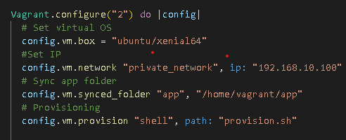

# Linux and BASH commands
Below are the different levels at which a machine can be interacted with, for our purposes we are interested in the `user level`
### Base level
* The physical hardware
### Kernel level
* Kernel - core of Os- how the machine works and does what we want it to do
* Login security
### User level
* Shell (command line) can give it commands to talk to and interact with OS
* Interacting with virtual machines- no graphical interface therefore need to use commands to navigate and interact
* This is the level at which we will be operating
### GUI
* Graphical User Interface
* Graphics, mouse, etc
## Linux and bash commands
`Flags` are put after a command and they give it more specific instructions, tailoring the output further. For instance, the command `uname` outputs system information, but we can further tailor the output using flags as seen below:

* `uname` system info - gives name of kernel - needs a flag
* `-a` flag for all- gives us all the info from the command
* `--all` is the long version, needs 2 --
* So for `uname` -> `uname -a`
* `uname -s` Displays the system name. This flag is on by default. The -s option is mutually exclusive with the -V option.
* `uname -r` Displays the release number of the operating system
* `uname -m` Displays the system model name. If the model name attribute does not exist, a null string is displayed.
* `uname -i` hardware platform
* `uname -o` OS
* Flags can be combined
`unamme -si` gives kernel name and hardware platform

## Navigation
* `cd` to begin changing folder , followed by folder name, or `cd ..` to go back a folder
* `ls` lists current directory contents
* `cd ../../` goes back 2 levels
* `cd /` goes back to root directory
* `cd ~` goes back to root directory -> takes you to your home dir, by default root and home are the same
* `ls -l` (l stands for long format) lsit files and permissions on those files and folders

* Absolute path - from root directory
* Relative path- from current dir
### Example absolute paths in different systems
* Linux/Mac absolute path -> /users/username/Documents/myfile.tx/etc...
* Windows absolute path -> C:\users\username\Documents\myfile.txt/etc..
* Web URLS absolute path -> https://www.mysite.com/myfolder/subfolder/sub/sub2/page1.html
## Creating files and folders
* `touch <filename.extension` > makes and empty file
* `nano myfile.txt` creates and opens the file editor
* Can use `nano filename` to edit a file if it is in the same directory
* Within `nano` can write but cant use mouse to navigate
* `CTRL + x` to exit , then `y` then `ENTER`
* `cat filename` views contents in terminal
* `mkdir new_folder` to make a folder
* To have spaces in folder name, `mkdir "folder with spaces"` - add double qoutes around the folder name
## Copy files 
* `cp <myfile.txt> <myfile2.txt>`
* Can specify directory to copy into ` cp <myfile.txt> <dir_name>/<myfile2.txt>`
## Copy folder
* `cp -rf <name_of_folder_to_copy_> <new_folder>`
* `-rf` stands for recursive force, the recursive aspect tells linux to go through every folder within the target folder, while the force aspect makes linux run the command despite any barries
* `rsync -r <base_folder> <folder_to_be_synced>` - creates the base folder with its content in the folder to be synced
# Moving files
* `mv <filetomove> <folder_name>`
* `mv <filetomove> ../../../ <folder_name>` to move file into a deeper folder -> goes backwards
* `mv` can be used to rename files `mv <file> <newfilename>`

## Deleting files
* `rm file_name` for removing - **THERE IS NO CHECK**
* `rm -rf folder_name` for removing folder and all contents (recursive- deletes all contents, force- even if permission needed or a file from that folder is open)
* `rm -rf` **THIS WILL DELETE EVERYTHING DO NOT DO IT**
## Orientating commands
* `pwd` prints working directory
* can do `command --help` to get a breakdown of everything a command does
* `man ls` takes to a screen with all terminal commands / flags - press `q` to quit
* `man -k keyword` will bring up documentation with specified keyword
* `grep` command searches for the pattern specified by the pattern parameter and writes each matching line to standard output
`grep <parameter> <specificfile>` search for the parameter in a file
`grep <parameter> *` search for the word within the whole directory
`grep <parameter> * -R`. Recursive search. Search the whole directory and the directories within the directory

## Wild card keys
A wildcard in Linux is a symbol or set of symbols representing other characters. It is generally used in substituting any string or a character
* `?` will match a single character. For example, `S?? n` will match anything that will begin with S and end with n and has two characters between them
* `[]` will match the range of characters withing the brackets, starting and ending with what comes before and after the brackets, for instnace ` a[e-i]d` will return anything that starts with `a` and ends with `e` while also having any letter in the middle form the range e-i. Alternatively, the middle argument can be amde without a - to be more specific and not use a range
* The `*` will return any number of characters and some examples can be seen below:
* `a*d` will return all characters found between a and d
* `ls f*` -> shows all files with ls, but only ones that have f in the name can specify any word/ character, not just f

## Permissions
* `r`(read) = read only
* `w`(write) = write permissions- can change the file contents
* `x`(execute) = can execute the file - can run it
* Files show 3 sets of permissions for 3 sets of people:
* `Owner`  - `Group`  -`Others/all`
* Permissions are always presented in the order : `Read, Write, Execute`
* E.g: r-x means you can read and execute, not write
*`ls -l file_name` to view permissions on a specific file 

## Change permissions
* `sudo chmod` (stands for change file, mode bits(permissions))
* `sudo chmod u+x filename` the `u` stand for users, followed by either `+ -` to add or take away permissions, then the permissions letter
* `u - user/owner`
* `g - group`
* `o - other/everyone else`
* The above is long hand, below is shorthand
* Give permissions to all: `sudo chmod 777 filename`
* Can use online calculator to workout permission numbers for different people - https://chmod-calculator.com/
* Can also use the following information to work out permissions
* `Read` = 4
* `Write` = 2
* `Execure` = 1
* `755`-> User everything, group and other `read` and `execute`
* `541`-> User read and execute, group read only, other execute only
* `764`-> User everything, group read and write, other just read
## Process management- linux task manager
* `top` shows all the currently running processes in real time -> gives real time stats but also locks terminal
* `ps` (processes) - shows current processes being used in current terminal
* `ps aux` shows processes running in the whole system - its a snapshot
* `sleep 120 &` makes a process called `sleep` (same as pc sleep) (number returns how long you want it to run in `seconds`) (`&` tells it to run in the background)
* To kill a process need to know its `PID` which can be seen with `ps`
* `kill <PID>`
* Hard kill -> `kill -9 PID`
* Normal users can only kill processes they make, `sudo` can kill all
* Foreground processes run in the terminal- lock you out
* `CTRL Z` stops foreground processes
* `fg` brings them back (stands for foreground)

## Tree
* Can showcase files and folders in a better way than `ls`
* Need to install it -> `sudo apt install tree -y`
* Then type `tree` and it will show how your directories and files branch
* Can look at specific folder in tree format -> `tree foldername`
* piping `|`- puts the previous commands output into the next command
* E.g: `ps aux | grep nginx` : this will store the autput of `ps aux` into the `grep nginx`. Running the whole command will highlight any instances of `nginx` in the `ps aux` menu
* stddr

## Updating the development environment - Syncing folder with dev environment
**When starting make sure no development environment is running. Also need to make sure that the file to be uploaded and the environment file are both in the same directory as the vagrant file before starting**
* Sync new application to virtual environment by putting the following code in the vagrant file in you IDE. Best to put it under the box configuration line for clarity -` config.vm.synced_folder "folder_you_want_to_sync", "/home/vagrant/app` specify path to the new app
* Full command-> `config.vm.synced_folder "app", "/home/vagrant/app"`
* Need to specify where to put folder in virtual machine, this is done by the code `home/vagrant/foldername` (in this case app)
* Folder should now be in virtual environment
## Updating the development environment- Running tests
* In vscode :`cd` into `spec-tests` which is found in the environment folder.
* The `spec-tests` folder is premade by someone else, and it has all the tests which need to be run by us to make sure that the developer environment has everything that it needs
* Run `gem install bundler` - installs a ruby testing framework
* Run `bundle` bundle all the tests into 1 so they run at the same time
* `rake spec` will run all the tests in the framework and return information on passed and failed tests
* In this example out of 9 tests, 7 failed and the reasons are listed below:
1) nginx not installed
2) nginx not running
3) nginx not enabled
4) 80 not listening  -nginx opens port 80 and lets it listen
5) nodejs not installed
6) nodejs not correct version
7) pm2 not intalled
* Specific port that things need to go to
## Updating the development environment- Updating the App
**DONT FORGET SUDO**
* In github virtual machine, run:`sudo apt-get update` -> updates database so it knows what upgrades are available
* In github virtual machine, run:`sudo apt-get upgrade` -> makes all the changes
* In github virtual machine, run:`sudo apt-get install nginx -y` -> installs `nginx` and the `-y` automatically says `yes` to prompts in the process
* In github virtual machine, run: `sudo systemctl enable nginx` (can also use `sudo systemctl start nginx`) -> Enable nginx 
* Can run `rake spec` again to see progress
* Still need `nodejs` with a specific version and `pm2`
* If you dont need a specific version can just do `sudo apt-get install package_name`
* Different for different software, for nopdejs : `sudo apt-get install python-software-properties` - installs dependencies needed for nodejs
* Then run : `curl -sL https://deb.nodesource.com/setup_6.x | sudo -E bash -` tells appt to overwrite the version of node js with this version
* Lastly, run : `sudo apt-get install nodejs -y`
* `rake spec` update should show that only pm2 is missing now
* pm2 is installed using nodejs
* Run: `sudo npm install pm2 -g`
* One final `rake spec` should return no errors
* In github virtual machine app folder: Run `npm install` to install app
* After the install run: `node app.js`
* Should display : "Your app is ready and listening on port 3000"
* This will run in the foreground, to access it will need to enter the ip, adding a :3000 at the end
## Provisioning
* Works but took a long time
* With provisioning, can do all of that within the vagrant file, so when `vagrant up` is ran everything should be working
* Provisioning -> preparing things before you need them
* Provisioners in Vagrant allow you to automatically install software, alter configurations, and more on the machine as part of the vagrant up process
## When provisioning happens
* On the first vagrant up that creates the environment, provisioning is run. If the environment was already created and the up is just resuming a machine or booting it up, they will not run unless the `--provision` flag is explicitly provided.
* When vagrant provision is used on a running environment.
* When `vagrant reload --provision` is called. The `--provision` flag must be present to force provisioning.
* You can also bring up your environment and explicitly not run provisioners by specifying `--no-provision`.
## Shell provisioner - Separate shell file
* Can put all commands into a file and run them
* Make a `provision.sh` file in the same directory as vagrant
* Need to add something to top of file so target system knows what sort of file it will be running : `#!/bin/bash` -> tells whatever is running the file that its a `bash` script
* When entering the linux commands, must specify `-y` to automate response because we can't answer the question manually
* If the file is on the same directory level as the vagrant file, but **not in** the vagrant file, need to do `path: shell_file.sh`, otherwise `inline: script_name`
* Full command: `config.vm.provision "shell", path: "provision.sh"`
* Can check version of installed software, e.g: `nginx -v`
* Can check if `nginx` is enabled : `sudo systemctl config nginx` where `nginx` is the name of the program to be checked
## Shell provisioner - script in the vagrant file
* The Vagrant Shell provisioner allows you to upload and execute a script within the guest machine
* `inline` (string) - Specifies a shell command inline to execute on the remote machine
* For example:
```ruby
Vagrant.configure("2") do |config|
  config.vm.provision "shell",
    inline: "echo Hello, World"
end

```
* The `config.vm.provision "shell"` line is used to define that we are using a `shell` script
* Whatever follows the `inline:` will be run in the virtual machine, in this case this will be ` Hello, World`
* Another example can be seen using a `script`:
```ruby
$script = <<-SCRIPT
echo I am provisioning...
date > /etc/vagrant_provisioned_at
SCRIPT

Vagrant.configure("2") do |config|
  config.vm.provision "shell", inline: $script
end
```
* Here, the `script` is specified to be run by `inline:`, which will output `I am provisioning...`
* Notice how the `script` starts with `<<-SCRIPT` and ends with `SCRIPT`. This is known as a `Here Document` or a `heredoc`
* Also notice how every block of code is finalised with `end` which is on the same indentation level as `Vagrant.configure`

## Setting up a Virtual Vagrant Developer Environment from scratch using provisioning
1) In gitbash terminal, navigate to desired directory
2) In the directory, run `vagrant init ubuntu/xenial64` which will initialise a vagrant cinfiguration file for a linux VE
3) Navigate to the vagrant file in your IDE and add the following doe: `config.vm.network "private_network", ip: "192.168.10.100"` - this will make the IP address static, you can make it whatever you like as long as it complies with formatting requirements.
4) Unzip your `app` and `environment` folders into the same directory as your vagrant files
5) Sync your app with your vagrant VE by putting the following code in your vagrant file : `config.vm.synced_folder "app", "/home/vagrant/app"`
6) We will be provisioning our VE with a bash script, so make a new file called `provision.sh` in the same directory as the vagrant file - the `sh` is important to designate it as a shell file
7) Go into the `provision.sh` file and on the first line type the following code :`#!/bin/bash`. This tells any program that will run the file that it is a bash script.
8) Now, instead of entering the commands manually in the VE, enter all of the required commads in the `bash` file.
9) For this example it will look like the following:
```ruby
#!/bin/bash

# Update and upgrade
sudo apt-get update -y
sudo apt-get upgrade -y


# Install Nginx
sudo apt-get install nginx -y

# Enable or Start Nginx
sudo systemctl enable nginx -y

# Install nodejs dependencies
sudo apt-get install python-software-properties

# Overwrite with desired version of nodejs
curl -sL https://deb.nodesource.com/setup_6.x | sudo -E bash -

# Install nodejs
sudo apt-get install nodejs -y

# Install pm2
sudo npm install pm2 -g

# Install app
cd app; npm install
```
10) The comments explain what each line of code does
11) Navigate into your vagrant file and enter the following code: `config.vm.provision "shell", path: "provision.sh"`
12) If you have followed every step correctly, your vagrant file should look like this :




13) Run your git bash terminal as administrator and once inside run `vagrant up`
14) The run `vagrant ssh` to enter the VE
15) Optionally, you can check whether your programs are correctly installed by running the following code:
16) `nginx -v` will check the version of nginx, can check the versions of any program
17 `sudo systemctl config nginx` will check if nginx is enabled, again, you can swap nginx for any other program you wish to check the status of
18) If everything is installed properly, navigate to folder `app` in the VE
19) To run the app, run: `node app.js` which should have the following output:


20) To check everything is fine, navigate to the webpage using the ip + the port number -> `192.168.10.100:3000`
21) You should see the following webpage:


# Reverse proxy
## What are Ports
* A port is a virtual point where network connections start and end. Ports are software-based and managed by a computer's operating system. Each port is associated with a specific process or service. Ports allow computers to easily differentiate between different kinds of traffic: emails go to a different port than webpages, for instance, even though both reach a computer over the same Internet connection
* A port or port number is a number assigned to uniquely identify a connection endpoint and to direct data to a specific service
## Proxy and reverse proxy
* `Proxy`-> A proxy server, sometimes referred to as a forward proxy, is a server that routes traffic between client(s) and another system, usually external to the network. By doing so, it can regulate traffic according to preset policies, convert and mask client IP addresses, enforce security protocols, and block unknown traffic.
* `Reverse poxy` -> A reverse proxy is a type of proxy server. Unlike a traditional proxy server, which is used to protect clients, a reverse proxy is used to protect servers. A reverse proxy is a server that accepts a request from a client, forwards the request to another one of many other servers, and returns the results from the server that actually processed the request to the client as if the proxy server had processed the request itself. The client only communicates directly with the reverse proxy server and it does not know that some other server actually processed its request
## Proxy benefits
By employing a proxy server, clients can safeguard their vital data from malicious cyber-attackers. Seamlessly protecting confidential information, these proxies provide an extra layer of security for all online users!
Proxy servers can be used to access blocked or restricted websites, opening up a world of possibilities for those working in an office or school. Easily bypassing any geographic boundaries put in place by certain sites, users are free to explore content from all over the globe!
Proxy servers provide a unique layer of protection to users, ensuring their online privacy and security while they surf the web. By employing various proxies, clients can rest assured that no one has access to their personal details or browsing history – allowing them peace of mind when exploring the digital realm.
Proxy servers are invaluable tools for improving user experience and accelerating digital operations. With their formidable caching capabilities, they can significantly enhance data transmission speeds – streamlining the process of information retrieval like never before!
Accessing websites with a proxy server is more efficient than going directly to the source. Its cache system stores recently requested webpages, allowing it to serve multiple requests from the same page without having to request each one individually – thus reducing bandwidth usage and increasing network performance.
Companies can rely on proxy servers to help keep their network secure by disallowing access to certain websites. Instead of simply blocking out sites, proxies route users away from restricted pages and maintain a log of all web requests so businesses know exactly how much time is being spent online. This provides greater transparency into employee internet usage while also keeping networks safe and sound!
With a proxy server, increased privacy is just the beginning. Web requests can be encrypted to keep confidential data and transactions private from third-party snoopers. Organizations benefit even further with added security measures that reduce potential malware threats while providing secure connections for safeguarding sensitive corporate information.
## Proxy risks
If you’re looking for a proxy server with an active cache system, be sure to consider dedicated or paid options. While free or shared solutions may seem appealing on the surface due to their price tag, they often come with significant security risks that could put your passwords and other sensitive data at risk – making investing in higher-quality proxies more than worth it!
Encrypted connections, such as those made through proxy servers, aren’t always foolproof. Data can still be exposed when TLS or SSL encryption is in place. Don’t let your sensitive information slip away without the protection it needs!
Through the use of a proxy server, it’s possible to bypass even the most stringent website blocking. Unfortunately, this often leaves students exposed to potentially harmful and offensive content.
When browsing with a proxy server, the responses users receive may be altered for better or worse. This can create unpredictable results depending on whether your connection is secured by encryption.

## Reverse proxy benefits
* `Encryption tool`: Encryption can be expensive for an origin server but using reverse proxies can help with this. They can decrypt all incoming requests and encrypt all outgoing requests (SSL/TSL). 
* `Caching`: Reverse proxies can also cache content improving the performance speed, reducing page load times and improving content delivery to clients. 
* `Load balancing`: Reverse proxies can help with the traffic flow on the main server. They can reduce the load on the main server by evenly distributing the load on all the servers. These proxies will also send clients to the servers which are located nearest to them, reducing response times. 
* `Security`: Your origin server’s IP address is masked which provides protection against potential attacks, such as DDoS attacks. You can also place a web application firewall on your reverse proxies for further protection against hackers and bots. 
* `Testing`: Reverse proxies can perform A/B testing and multivariate testing without JavaScript tags or coding.
## Risks with reverse proxy
* `Risk of information stored`: Since a reverse proxy can track IP addresses and encrypt/decrypt information, it is also able to store data such as passwords. This can be a problem if it’s run by a malicious party. Moreover, with such sensitive information it can be risky using a reverse proxy of a third party as they need to adhere to the triad of Confidentiality, Integrity and Availability. 
* `HTTP request smuggling`: This is a web application attack that exploits differences between web servers and their reverse proxies. It can allow the attacker to submit a request with a user’s session and interfere with the processing of HTTP requests. 
* `Risk of failure`: If the proxy is fronting many different domains, its outage can bring down all of those. Also, if there is no way to access the back-end server directly, the outage can disrupt operations. 


## Nginx default configuration
The pathway to the default nginx file is : `/etc/nginx/sites-available/default` and the contents are as follows
```bash
##
# You should look at the following URL's in order to grasp a solid understanding
# of Nginx configuration files in order to fully unleash the power of Nginx.
# http://wiki.nginx.org/Pitfalls
# http://wiki.nginx.org/QuickStart
# http://wiki.nginx.org/Configuration
#
# Generally, you will want to move this file somewhere, and start with a clean
# file but keep this around for reference. Or just disable in sites-enabled.
#
# Please see /usr/share/doc/nginx-doc/examples/ for more detailed examples.
##

# Default server configuration
#
server {
        listen 80 default_server;
        listen [::]:80 default_server;

        # SSL configuration
        #
        # listen 443 ssl default_server;
        # listen [::]:443 ssl default_server;
        #
        # Note: You should disable gzip for SSL traffic.
        # See: https://bugs.debian.org/773332
        #
        # Read up on ssl_ciphers to ensure a secure configuration.
        # See: https://bugs.debian.org/765782
        #
        # Self signed certs generated by the ssl-cert package
        # Don't use them in a production server!
        #
        # include snippets/snakeoil.conf;

        root /var/www/html;

        # Add index.php to the list if you are using PHP
        index index.html index.htm index.nginx-debian.html;

        server_name _;

        location / {
                # First attempt to serve request as file, then
                # as directory, then fall back to displaying a 404.
                try_files $uri $uri/ =404;
                # proxy_pass http://localhost:8080;
                # proxy_http_version 1.1;
                # proxy_set_header Upgrade $http_upgrade;
                # proxy_set_header Connection 'upgrade';
                # proxy_set_header Host $host;
                # proxy_cache_bypass $http_upgrade;
        }

        # pass the PHP scripts to FastCGI server listening on 127.0.0.1:9000
        #
        #location ~ \.php$ {
        # include snippets/fastcgi-php.conf;
        #
        #       # With php7.0-cgi alone:
        #       fastcgi_pass 127.0.0.1:9000;
        #       # With php7.0-fpm:
        #       fastcgi_pass unix:/run/php/php7.0-fpm.sock;
        #}

        # deny access to .htaccess files, if Apache's document root
        # concurs with nginx's one
        #
        #location ~ /\.ht {
        #       deny all;
        #}
}


# Virtual Host configuration for example.com
#
# You can move that to a different file under sites-available/ and symlink that
# to sites-enabled/ to enable it.
#
#server {
#       listen 80;
#       listen [::]:80;
#
#       server_name example.com;
#
#       root /var/www/example.com;
#       index index.html;
#
#       location / {
#              try_files $uri $uri/ =404;
#       }
#
```
## Setting up a nginx reverse proxy
1) When in virtual environemt, use command: `sudo nano /etc/nginx/sites-available/default`. This should open up the default file which can be seen above.
2) Replace the line `try_files $uri $uri/ =404;` with :`proxy_pass http://localhost:3000/;`
3) To confirm the change, run : `sudo service nginx restart`
4) Navigate to the `app` folder and run the app
5) Enter the IP into the browse without the 3000 port code, you should see the following out put:


## Setting up a nginx reverse proxy- provisioning
1) Inside your `app` folder (the one which is synced), creater a file called `reverse_proxy`
2) Inside the file, enter this code :
```bash
server {
        listen 80 default_server;
        listen [::]:80 default_server;

        root /var/www/html;


        index index.html index.htm index.nginx-debian.html;

        servername ;

        location / {
                proxy_pass http://localhost:3000/;
        }

}
```
3) Inside your `provision.sh` file, add the following code:
4) Run: `sudo rm /etc/nginx/sites-available/default` -> This removes the default nginx proxy configuration
5) Run: `sudo cp app/reverse_proxy /etc/nginx/sites-available/default` -> This copies the contents of your `reverse_proxy` file (which has the reverse proxy configuration) and copies into the path :`/etc/nginx/sites-available/default` under the name `default`, since no file called `default` exists after we deleted it.
6) Notice how we must specify how to get to the `reverse_proxy` file before we can copy it. When we launch our VE we are in the `vagrant` directory, adn the command shows the `relative path` to the file. The `absolute path` can also always be used instead. You must also declare the `absolute path` to the target file.
7) Run: `sudo systemctl restart nginx -y` -> This will restart `nginx`, saving the new configuration.
8) If entered correctly, your commands should look like this :
```bash
# Remove default nginx configuration
sudo rm /etc/nginx/sites-available/default
# Copy the reverse proxy file containing the relevant code into that location
sudo cp app/reverse_proxy /etc/nginx/sites-available/default
# Restart nginx to confirm changes
sudo systemctl restart nginx -y
```
* The comments arent neccessary, they're only there for clarity
* **Note- important to only run these commands after installing and enabling nginx in your virtual machine**


