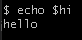
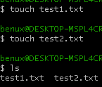
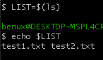

## Variables in Linux
Variables function the same way in bash and linux as they do in other programming languages: they are character strings which store data that we assign
Variables are defined using an `=`:
```bash
hi="hello"
```
* Notice how when variables are defined, there are no spaces between the variable name, the `=` and the variable contents
* To print a variable you must the `echo` command and prefix the variable name with a `$`:



## Storing outputs from a command inside a variable
In this example we are going to make 2 empty files called `test1.txt` and `test2.txt` inside a fresh directory. We are then going to store the output from `ls` inside a variable called `LIST`.
* First we will make the text files using `touch` which makes empty files
```
touch test1.txt
touch test2.txt
```



* Output can be stored in variables with the following syntax : `var=$(command)`
```
LIST=$(ls)
echo $LIST

# Output: test1.txt test2.txt
```




