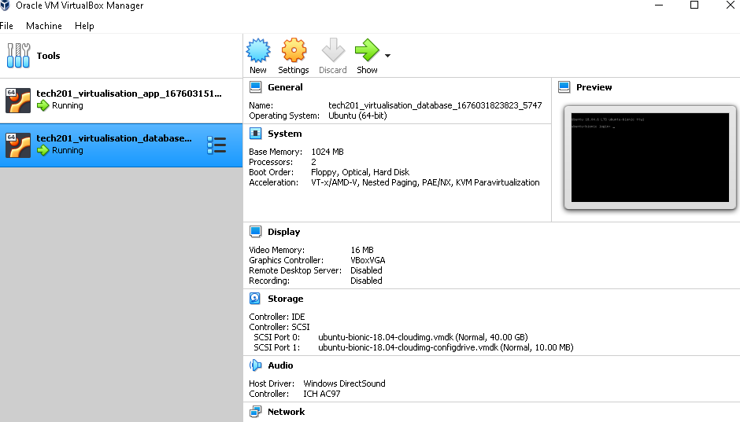

# Preparations for MultiMachine Vagrant
## Configuring the vagrant file
1) Create a configuration vagrant file by running the following in git bash:
```bash
vagrant init ubuntu/xenial64
```
* You should now have a vagrant file in your current directory :

2) Open your vagrant file and delete all contents. Replace with the following code block:
```ruby
Vagrant.configure("2") do |config|
  config.vm.define "app" do |app|
    app.vm.box = "ubuntu/bionic64"
    app.vm.network "private_network", ip: "192.168.10.100"
   
    app.vm.synced_folder "app", "/home/vagrant/app"
    app.vm.provision "shell", path: "provision.sh", privileged: false
  end

  config.vm.define "database" do |database|
    database.vm.box = "ubuntu/bionic64"
    database.vm.network "private_network", ip: "192.168.10.150"
    
    database.vm.synced_folder "environment", "/home/vagrant/environment"
  end
end
```
### Command breakdown
**TO CONTINUE WITH THE GUIDE SKIP TO THE NEXT SECTION**

## Configuring additional files
1) Download and unzip `app` and `environment` folders in the same directory as your vagrant file
2) Create a bash file in the same directory as your vagrant file called `provision.sh`. Copy the following code :
```bash

# Install Nginx
sudo apt-get install nginx -y

# Enable or Start Nginx
sudo systemctl enable nginx -y


# Reverse proxy setup:
# Remove default nginx configuration
sudo rm /etc/nginx/sites-available/default
# Copy the reverse proxy file containing the relevant code into that location
sudo cp app/reverse_proxy /etc/nginx/sites-available/default
# Restart nginx to confirm changes
sudo systemctl restart nginx -y

# Install nodejs dependencies
sudo apt-get install python-software-properties

# Overwrite with desired version of nodejs
curl -sL https://deb.nodesource.com/setup_6.x | sudo -E bash -

# Install nodejs
sudo apt-get install nodejs -y

# Install pm2
sudo npm install pm2 -g

# Install app
cd app; npm install
```
### Command breakdown
**TO CONTINUE WITH THE GUIDE SKIP TO THE NEXT SECTION**
## Launching App and Database virtual environments
1) Launch VirtualBox
2) In your Vscode terminal type:
```bash
vagrant up
```
3) You should see the following in your VirtualBox :


* If you cannot see either `app` or `database`, run the the following in your `gitbash` terminal:
```bash
vagrant up
```
* The status of your virtual machines can be checked by running the following in `gitbash`:
```bash
vagrant status
```
## Configuring `Database` Virtual Machine
1) In `gitbash`, run:
```bash
vagrant ssh database
```
* You should now be inside your database virtual machine
2) Run the following code to get the database key:
```bash
sudo apt-key adv --keyserver hkp://keyserver.ubuntu.com:80 --recv D68FA50FEA312927 
```
* An import confirmation should be displayed
* Check the command went through succesfully by running:
```bash
echo "deb https://repo.mongodb.org/apt/ubuntu xenial/mongodb-org/3.2 multiverse" | sudo tee /etc/apt/sources.list.d/mongodb-org-3.2.list
```
* This should output: `deb https://repo.mongodb.org/apt/ubuntu xenial/mongodb-org/3.2 multiverse`
3) Update the system:
```bash
sudo apt-get update -y
```
4) Upgrade the system:
```bash
sudo apt-get upgrade -y
```
5) Install the correct version of the database :
```bash
sudo apt-get install mongodb-org=3.2.20 -y
```
6) Install the database:
```bash
sudo apt-get install -y mongodb-org=3.2.20 mongodb-org-server=3.2.20 mongodb-org-shell=3.2.20 mongodb-org-mongos=3.2.20 mongodb-org-tools=3.2.20
```
7) Start the database:
```bash
sudo systemctl start mongod
```
8) Enable the database:
```
sudo systemctl enable mongod
```
9) Check the status of the database
```
sudo systemctl status mongod
```
10) Open the database configuration file in editor mode:
```
sudo nano /etc/mongod.conf
```
11) Locate `# network interfaces` and change `bindIp: 127.0.0.1 ` to `bindIp: 0.0.0.0` to allow all IPs to connect
12) Restart the database :
```
sudo systemctl restart mongod
```
13) Enable the database:
```
sudo systemctl enable mongod
```
### Command breakdown
**TO CONTINUE WITH THE GUIDE SKIP TO THE NEXT SECTION**
## Configuring `App` Virtual Machine
1) In another `gitbash` terminal run the command:
```
vagrant ssh app
```
* You should now be in your `app` virtual machine
2) Navigate to your `app` folder using `cd` until you're in a folder which has `app.js` when `ls` is ran
3) Create an environmental variable to link to the `posts` folder of the database:
```
export DB_HOST=mongodb://192.168.10.150:27017/posts
```
* Run `printenv DB_HOST` to check the contents, if done correctly you should be displayed : `mongodb://192.168.10.150:27017/posts`
4) Seed the database :
```
node seeds/seed.js
```
* If done correctly, should output : `Database Seeded`
5) Launch the app:
```
node app.js
```
6) In your web browser, enter the following URL:
```
http://192.168.10.100/posts
```
* The app content should now be updated with something like the following:


 ### Additional context
