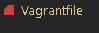

# Setting up a fully provisioned MultiMachine vagrant environment with reverse proxy
## 1) Configuring the vagrant file
1) Create a configuration vagrant file by running the following in git bash:
```bash
vagrant init ubuntu/xenial64
```
* You should now have a vagrant file in your current directory :

2) Open your vagrant file and delete all contents. Replace with the following code block:
```ruby
Vagrant.configure("2") do |config|
  config.vm.define "database" do |database|
    database.vm.box = "ubuntu/bionic64"
    database.vm.network "private_network", ip: "192.168.10.150"
    
    database.vm.synced_folder "environment", "/home/vagrant/environment"
    database.vm.provision "shell", path: "db_provision.sh"
  end
  config.vm.define "app" do |app|
    app.vm.box = "ubuntu/bionic64"
    app.vm.network "private_network", ip: "192.168.10.100"
   
    app.vm.synced_folder "app", "/home/vagrant/app"
    app.vm.provision "shell", path: "provision.sh", privileged: false
  end

  
end
```
### Command breakdown
**TO CONTINUE WITH THE GUIDE SKIP TO THE NEXT SECTION**
## 2) Provisioning the `app` VE
1) Create a `.sh` file called `provision.sh`. Create the file **on the same folder level as the vagrant file for this guide to work**


2) Copy the following code into the file: 
```bash
#!/bin/bash

# Update and upgrade
sudo apt-get update -y
sudo apt-get upgrade -y


# Install Nginx
sudo apt-get install nginx -y

# Enable or Start Nginx
sudo systemctl enable nginx -y


# Reverse proxy setup:
# Remove default nginx configuration
sudo rm /etc/nginx/sites-available/default
# Copy the reverse proxy file containing the relevant code into that location
sudo cp app/reverse_proxy /etc/nginx/sites-available/default
# Restart nginx to confirm changes
sudo systemctl restart nginx -y

# Install nodejs dependencies
sudo apt-get install python-software-properties

# Overwrite with desired version of nodejs
curl -sL https://deb.nodesource.com/setup_6.x | sudo -E bash -

# Install nodejs
sudo apt-get install nodejs -y

# Install pm2
sudo npm install pm2 -g

# Install app
cd app; npm install
# Seed the Database
node seeds/seed.js

# Environmental vabriable

echo 'export DB_HOST=mongodb://192.168.10.150:27017/posts' >> ~/.bashrc 
source .bashrc

# Enable reverse proxy
sudo systemctl restart nginx 
```
### Command breakdown
**TO CONTINUE WITH THE GUIDE SKIP TO THE NEXT SECTION**
## 3) Provisioning the `database` VE
1) Create a `.sh` file called `db_provision.sh`. Create the file **on the same folder level as the vagrant file for this guide to work**


2) Copy the following code into the file: 
```bash
#!/bin/bash


sudo apt-key adv --keyserver hkp://keyserver.ubuntu.com:80 --recv D68FA50FEA312927 
echo "deb https://repo.mongodb.org/apt/ubuntu xenial/mongodb-org/3.2 multiverse" | sudo tee /etc/apt/sources.list.d/mongodb-org-3.2.list

sudo apt-get update -y
sudo apt-get upgrade -y

sudo apt-get install mongodb-org=3.2.20 -y
sudo apt-get install -y mongodb-org=3.2.20 mongodb-org-server=3.2.20 mongodb-org-shell=3.2.20 mongodb-org-mongos=3.2.20 mongodb-org-tools=3.2.20

sudo systemctl start mongod
sudo systemctl enable mongod

sudo rm /etc/mongod.conf
sudo cp environment/replace_ip /etc/mongod.conf

sudo systemctl restart mongod
sudo systemctl enable mongod
```
### Command breakdown
**TO CONTINUE WITH THE GUIDE SKIP TO THE NEXT SECTION**
### 4) Provisioning reverse proxy
1) Create a file called `reverse_proxy` in the `app` folder


2) Inside the file, copy and paste the following :
```
server {
        listen 80 default_server;
        listen [::]:80 default_server;

        root /var/www/html;


        index index.html index.htm index.nginx-debian.html;

        server_name _;

        location / {
                proxy_pass http://localhost:3000;
        }

}
```
### Command breakdown
**TO CONTINUE WITH THE GUIDE SKIP TO THE NEXT SECTION**
## 5) Provisioning database configuration
1) Create a file called `replace_ip` in the `environment` folder


2) Inside the file, copy and paste the following:
```bash
# mongod.conf

# for documentation of all options, see:
#   http://docs.mongodb.org/manual/reference/configuration-options/

# Where and how to store data.
storage:
  dbPath: /var/lib/mongodb
  journal:
    enabled: true
#  engine:
#  mmapv1:
#  wiredTiger:

# where to write logging data.
systemLog:
  destination: file
  logAppend: true
  path: /var/log/mongodb/mongod.log

# network interfaces
net:
  port: 27017
  bindIp: 0.0.0.0


#processManagement:

#security:

#operationProfiling:

#replication:

#sharding:

## Enterprise-Only Options:

#auditLog:

#snmp:
```
## 6) Launch the app
1) Run `gitbash` as an administrator and navigate to the directory which has your `vagrant` file
2) Run both the virtual machines:
```bash
vagrant up
```
3) Enter the `app` virtual machine:
```bash
vagrant ssh app
```
4) Navigate to the directory with your `app.js` file
5) Once inside, launch the app:
```
node app.js
```
6) You should now be able to enter :`192.168.10.100/posts` and get the following output:


* Notice how because of the reverse proxy, we do not need to specify the port number